# Architecture Playground

Sketch a system-design architecture, wire components together with flows, declare
functional and non-functional requirements, and run a check to see how the design
holds up. The component vocabulary (load balancers, caches, queues, datastores, etc.)
is grounded in [donnemartin/system-design-primer](https://github.com/donnemartin/system-design-primer).

## Stack

- **Backend**: FastAPI + SQLAlchemy + SQLite (`backend/`)
- **Frontend**: React + TypeScript + Vite, canvas via `@xyflow/react`, state via `zustand` (`frontend/`)

## Running it

### Option A: Docker (recommended)

Requires [Docker](https://docs.docker.com/get-docker/) with Compose.

```bash
docker compose up --build
```

Open **http://localhost:8080**. The backend is also reachable directly at
http://localhost:8000 (e.g. for the FastAPI docs at `/docs`).

- `frontend/Dockerfile` builds the React app and serves it via nginx, which
  proxies `/api/*` to the `backend` container (`frontend/nginx.conf`) — no
  CORS involved, the browser only ever talks to nginx.
- `backend/Dockerfile` runs the FastAPI app with uvicorn. The SQLite database
  lives on a named volume (`backend_data`, mounted at `/app/data`) so data
  survives `docker compose down` / rebuilds — remove it with
  `docker compose down -v` to start fresh.
- First run seeds the 7 example templates below into the empty database
  (`backend/app/seed_templates.py`).

Stop everything with `docker compose down` (add `-v` to also drop the data volume).

### Option B: Run locally without Docker

#### Backend

```bash
cd backend
python3 -m venv venv
source venv/bin/activate
pip install -r requirements.txt
uvicorn app.main:app --reload --port 8000
```

This creates `backend/data.db` (SQLite) on first run, pre-seeded with the 7
example templates below (`backend/app/seed_templates.py` — only runs once,
against an empty database).

#### Frontend

```bash
cd frontend
npm install
npm run dev
```

Open http://localhost:5173 — the Vite dev server proxies `/api` to `http://localhost:8000`.

## How it works

1. **Spaces** — create a project ("space") from the home page.
2. **Components** — drag component types from the left palette onto the canvas.
   Click a component to edit its name, replica count, capacity, latency, or
   availability in the right-hand Properties panel.
3. **Flows** — drag from a node's right handle to another node's left handle to
   connect them. Click a connection to set its protocol (`sync_http`, `async_queue`,
   `tcp`).
4. **Requirements** — declare non-functional requirements (max latency, min
   throughput, min availability) or functional requirements (a required component
   sequence a request must pass through).
5. **Run** — saves the space and runs it through the heuristic rule engine, which
   checks for single points of failure, missing load balancers, direct
   client-to-database access, databases without caching, missing async
   decoupling, latency budget overruns, throughput bottlenecks, and estimated
   composite availability — then reports findings grouped by severity. Hover a
   finding to highlight the affected components/connections on the canvas.
6. **Language / theme** — the buttons in the top-right corner switch the UI
   between English/Russian and light/dark. Both choices persist in
   `localStorage`.
7. **Shareable/deep links** — `?project=<id>` opens straight into a space, and
   `?theme=light|dark` / `?lang=en|ru` force a specific look on load
   (`frontend/src/App.tsx`) — used to generate the screenshots below.

## Example architectures

Recipes for building common system-design patterns in the canvas, grounded in
[donnemartin/system-design-primer](https://github.com/donnemartin/system-design-primer).
Each one lists the components/connections to drop in, requirements worth
declaring, and which heuristic rules (`backend/app/simulation/heuristics.py`)
are relevant to it.

### 1. Horizontally scaled web tier

The baseline fix for "one server can't take the load" and "one server is a
single point of failure."

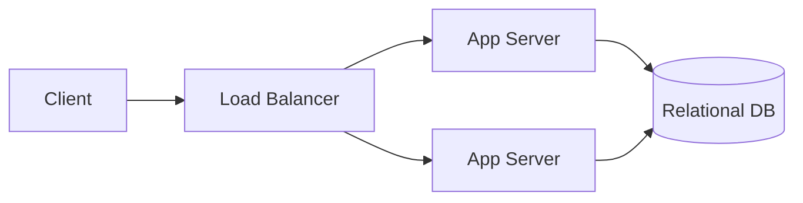

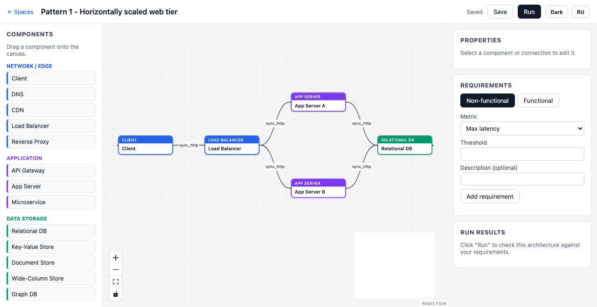

- Set **replicas ≥ 2** on the App Server(s), or drop in two separate `App Server`
  nodes fed by the same Load Balancer.
- Add a `min_throughput_rps` requirement above a single server's capacity.
- Relevant rules: `spof` (flags any App Server/DB left at replicas=1),
  `missing_load_balancer` (flags parallel instances with no LB upstream),
  `throughput_bottleneck` (flags the DB once traffic exceeds its capacity).

### 2. Cache-aside

Read-heavy traffic in front of a database that can't take direct load.

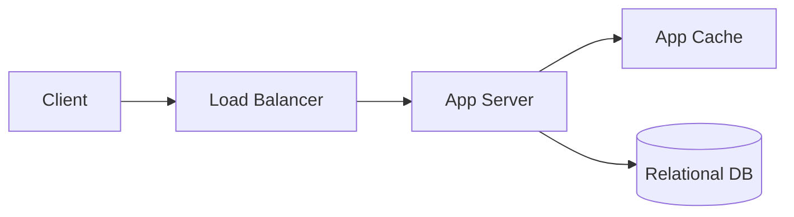

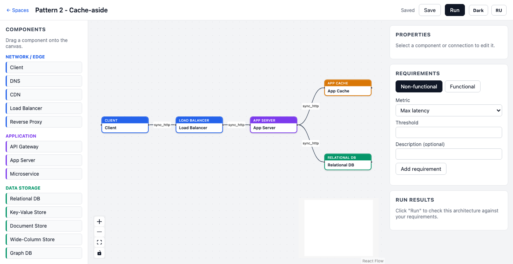

- Connect the App Server to **both** the cache and the DB (the app decides to
  check the cache first, then fall through to the DB on a miss — the tool
  models the topology, not the per-request branching).
- Relevant rule: `db_without_cache` — fires whenever a datastore has no cache
  type anywhere upstream of it; connecting the cache removes the finding.

### 3. CDN in front of static/edge content

Push static assets and cacheable responses to the edge, closer to users.

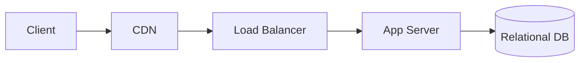

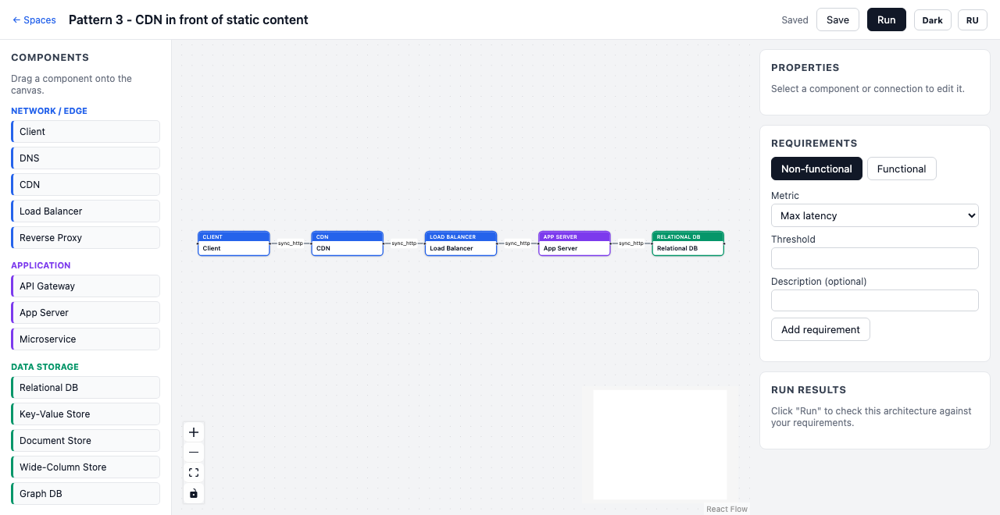

- The CDN is treated as `managed_ha` in the rule engine, so it's never flagged
  as a single point of failure even with replicas=1 (cloud CDNs are assumed
  inherently redundant).
- Add a `max_latency_ms` requirement — the CDN's own latency is included in
  the `latency_budget_exceeded` calculation for the synchronous path.

### 4. Async processing with a queue and worker

Decouple a slow or bursty operation (image resizing, sending email, etc.) from
the request/response path.

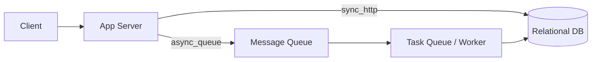

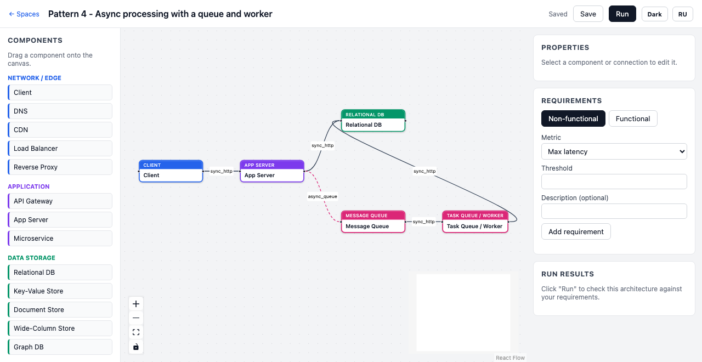

- Set the App Server → Message Queue connection's protocol to `async_queue` in
  the Properties panel — this tells the latency/throughput rules that the
  client doesn't wait on that branch.
- Relevant rule: `no_async_decoupling` — fires when a `min_throughput_rps`
  target is well above a datastore's capacity and nothing upstream of it is a
  queue; adding the queue (on the write path) clears it.

### 5. Read replicas (read/write splitting)

Scale reads independently of writes without sharding.

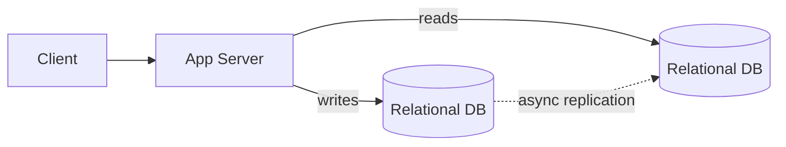

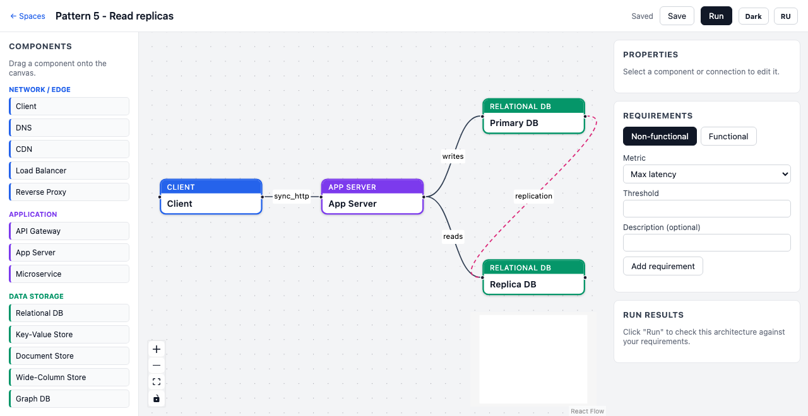

- Model the primary and replica as two separate `Relational DB` components
  (rename them "Primary DB" / "Replica DB" in the Properties panel);
  the app fans out reads and writes to each on separate connections.
- Give the replica a lower `availability_pct` if it's a single instance — the
  `availability_below_target` rule composes availability along whichever path
  a requirement's critical path follows.

### 6. API Gateway + microservices

Split a monolith into independently deployable services behind one entry point.

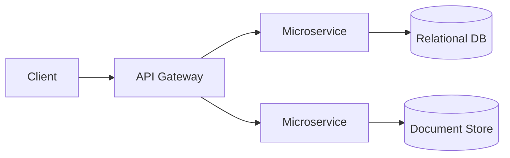

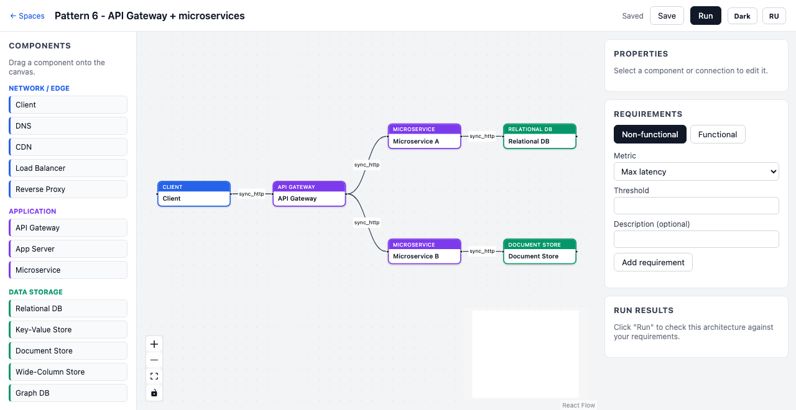

- Each microservice owns its own datastore (no shared DB) — a common
  microservices tenet, and it also keeps the `db_without_cache` /
  `throughput_bottleneck` findings scoped per-service instead of conflated.
- A `path_exists` functional requirement (e.g. `Client → API Gateway →
  Microservice → Relational DB`) is a good way to assert a specific service's
  request path actually exists in the graph.

### 7. Database sharding / federation

Split a dataset horizontally (sharding) or by function (federation) across
multiple database instances once one instance can't hold the load.

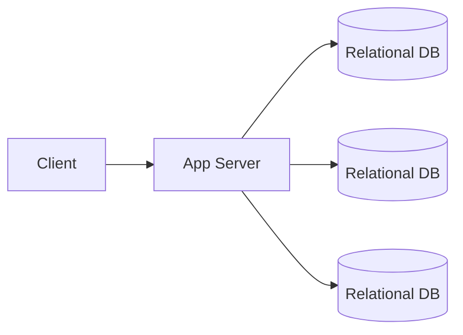

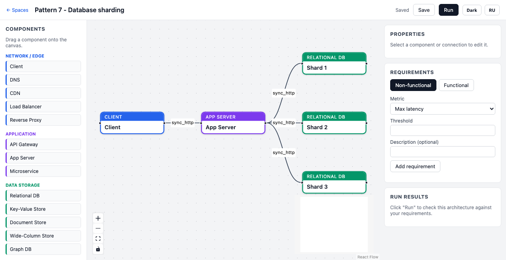

- The shard-routing logic itself lives in the app layer — the tool doesn't
  have a dedicated "shard router" component, so it's represented as the App
  Server fanning out to several same-type DB nodes.
- Relevant rule: `missing_load_balancer` — note it only fires for *identical*
  upstream fan-outs; since each shard is a distinct node with a distinct
  purpose (not redundant copies of the same data), this rule intentionally
  won't fire here — that's expected, not a bug.

## Simulation engine

Phase 1 (shipped) is a rule-based heuristic checker:
`backend/app/simulation/heuristics.py`.

A discrete-event load simulation (Phase 2, not yet built) is intended to live
alongside it as `backend/app/simulation/loadsim.py`, selected via
`POST /api/projects/{id}/simulate?mode=load` (currently returns `501`).

## Project layout

```
docker-compose.yml   Runs backend + frontend together (see Option A above)
backend/
  Dockerfile           Builds the FastAPI image (python:3.12-slim + uvicorn)
  app/
    main.py            FastAPI app, CORS, router wiring
    database.py         SQLAlchemy engine/session (SQLite; DATABASE_URL env override)
    models.py            ORM models: Project, Component, Connection, Requirement
    schemas.py             Pydantic models (Finding.details carries raw values for i18n)
    catalog.py               Static component catalog (system-design-primer types)
    seed_templates.py          Seeds the 7 example architectures on first run
    routers/
      projects.py             CRUD + full-graph save/load
      catalog.py                GET /api/catalog
      simulate.py                 POST /api/projects/{id}/simulate
    simulation/
      heuristics.py               Rule engine (Phase 1)
frontend/
  Dockerfile           Multi-stage build: node -> static assets served by nginx
  nginx.conf           Serves the SPA and proxies /api/* to the backend container
  src/
    api/client.ts       Typed fetch wrapper
    store.ts             zustand store for the current space
    types.ts              Shared TS types
    categoryColors.ts       Category -> accent color mapping
    i18n/
      language.ts             Persisted EN/RU language store
      translations.ts          UI chrome strings (EN/RU)
      catalogI18n.ts             Catalog label/description/category translations
      findings.ts                  Localized message templates, keyed by rule_id
      index.ts                       useT / useCatalogText / useFindingMessage hooks
    theme/
      themeStore.ts            Persisted light/dark theme store
    components/
      Canvas.tsx              React Flow canvas
      Palette.tsx               Drag-and-drop component palette
      ComponentNodeView.tsx       Custom node renderer
      PropertiesPanel.tsx          Edit selected component/connection
      RequirementsPanel.tsx         Add/list requirements
      ResultsPanel.tsx                Run results, hover-to-highlight
      LanguageSwitcher.tsx             EN/RU toggle button
      ThemeSwitcher.tsx                  Light/dark toggle button
    pages/
      ProjectList.tsx     Home page: list/create/open/delete spaces
      Editor.tsx           Main editor layout
```
